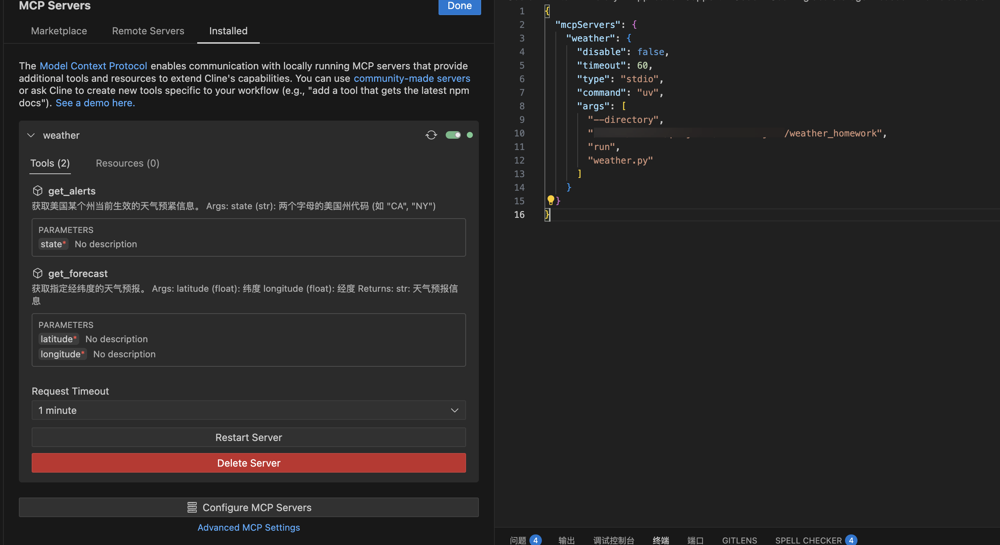

# 天气查询-作业
## 初始化项目

1. 安装 uv 包管理器
打开终端，运⾏以下命令（uv 是⼀个极速的 Python 包管理器。）
```shell
curl -LsSf https://astral.sh/uv/install.sh | sh
```
注意： 安装完成后，请务必重启终端，以确保uv 命令能够被系统识别。

2. 创建并设置 MCP 项⽬
```shell
# 为项目创建一个名为weather 的新目录
uv init weather
cd weather
# 创建并激活虚拟环境(用于隔离项目依赖)
uv venv
source .venv/bin/activate
# 安装项目所需的依赖包
uv add "mcp[cli]" httpx
# 创建MCP服务器代码文件
touch weather.py
```

## 实现 MCP 服务器

代码文件：[weather.py](./weather.py)

## 相关截图

### 配置 MCP 服务器


### 配置 cline


### 